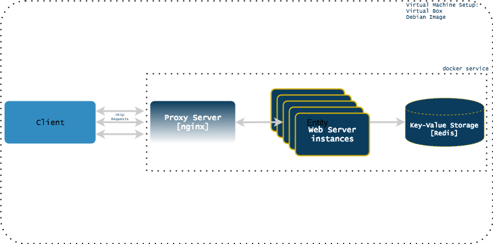

# Overview

This project is an experimental test on the scaling characteristics of
docker services. The setup includes a client, a proxy server and a
HTTP service connected to a redis DB where the proxy server, the HTTP
service and the database are run as  docker containers.



The proxy server is configured to listen for traffic on port 80
```
server{
	listen 80;
        location / {
	proxy_pass http://frontend:5000/factorial;
        }
}
```

To run a single instance of the service:
`sudo docker-compose up`